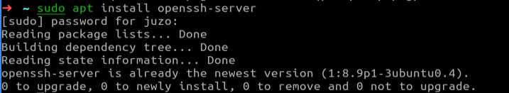
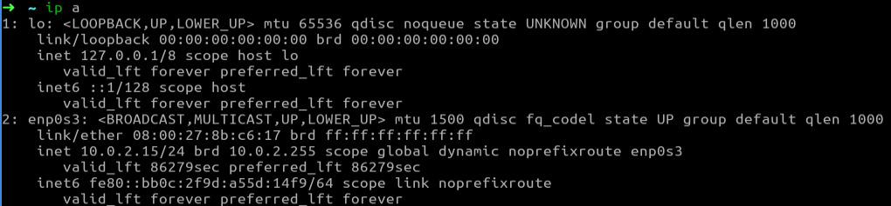
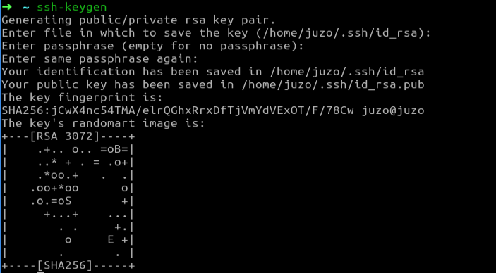

# DevOps: Лабораторная работа 1

## Задание:
Пользуясь терминалом на компьютере А перенести файл с компьютера Б на компьютер С, находящихся в одной локальной сети.

## Оборудование:
Для выполнения работы необходимо иметь 3 устройства с операционной системой на Linux, в моём случае это 3 виртуальные машины на Lubuntu развёрнутые с помощью Oracle VM VirtualBox.  

## Выполнение работы

### Этап 1. Первоначальная настройка

Выполнение лабораторной работы предполагает использование протокола **SSH**. Для его применения необходимо установить пакет **openssh-server**, для этого я запускаю следующую команду на компьютерах **pc-b** и **pc-c**:

`$ apt install openssh-server`

Это единственная команда(не считая `$ ip a`) которую необходимо выполнить на **pc-b** и **pc-c**, все следующие действие выполняются только на **pc-a**.

### Этап 2. Получение доступа к pc-b

Сначала нужно узнать **ip** компьютера **pc-b** с помощью команды:

`$ ip a`

Подключение к компьютеру **pc-b** я произвожу при помощи команды: 

`$ ssh [имя пользователя]@[ip устройства]`

Далее потребуется ввести пароль указанного пользователя на выбранном устройстве.

### Этап 3. Переноc файла с pc-b на pc-c

Теперь когда я подключился к терминалу **pc-b** я могу перенести файл с этого компьютера на **pc-c** с помощью команды:

`$ scp [путь к файлу на pc-b] [имя пользователя pc-c]@[ip pc-c]:[путь на pc-c]`

Осталось только ввести пароль пользователя pc-c.

## Задание со звёздочкой: Доступ по ключам

Для начала нужно создать пару «публичный ключ — приватный ключ». Публичный ключ копируется на компьютер с сервером SSH, то есть на компьютер, к которому будет осуществляться подключение и на котором будут выполнятся команды. Затем подключение выполняется обычным способом, но ввод пароля уже не требуется. Публичный ключ, который копируется на удалённый сервер, не является секретным. Один и тот же ключ можно использовать на разных серверах. Главное — хранить в секрете приватный ключ.

Команда для создания приватного ключа:

`$ ssh-keygen`

Команда для копирования ключа:

`$ ssh-copy-id [имя пользователя]@[ip]`

Нужно создать ключ на **pc-a**, подключиться с **pc-a** к **pc-b** по протоколу SSH, далее скопировать ключи на машину **pc-b** командой **ssh-copy-id**. Также необходимо аналогично сгенерировать ключи на машине **pc-b** и скопировать на **pc-с**. Теперь подключение по SSH будет происходить с помощью ключей! 

## Вывод

В данной лабороторной работе с помощью протокола SSH и утилиты scp я передал файл с устройства Б на устройство С, используя только терминал устройства А, также настроил подключение по ключам вместо паролей.