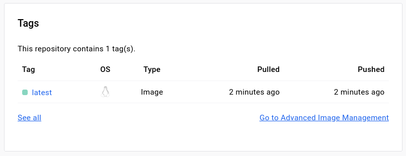
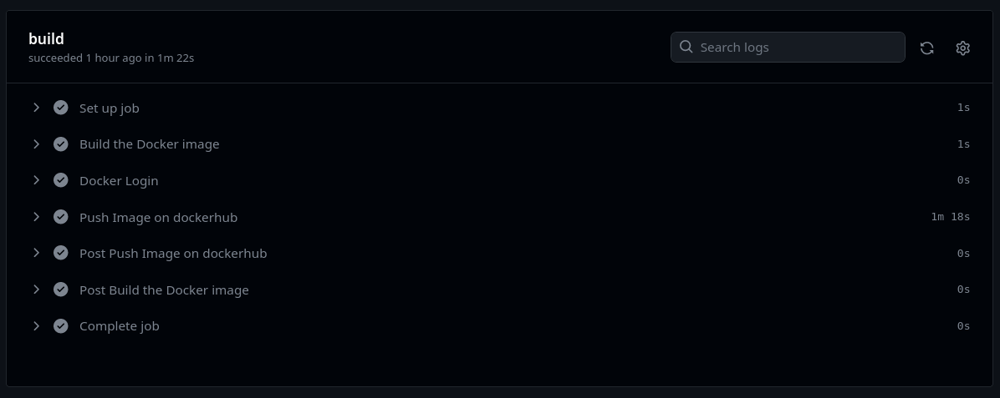

# DevOps: Лабораторная работа 3

## Задание:

Настроить workflow так, чтобы после пуша в репозиторий автоматически собирался докер образ и результат его сборки сохранялся куда-нибудь. 

## Выполнение работы

### Этап 1. Создание репозитория

Я создал [новый репозиторий](https://github.com/pheroom/clouds-devops-lab3) на github, склонировал его на свой компьютер и создал в папке проекта папки **.github** и **workflows** и файл **docker-build.yml**

Так же в настройках репозитория добавим логин и пароль от Docker-аккаунта в Secrets.

### Этап 2. Dockerfile

В репо создан проект на React и *Dockerfile* который создаёт образ этого проекта. Содержимое **Dockerfile** в репозитории:

```
FROM node:12.18.1

ENV NODE_ENV production

WORKDIR /app/

COPY ./my-app /app/

RUN npm install

CMD npm start
```



### Этап 3. Настройка workflows

Содержимое файла **docker-build.yml**:

``` yaml
name: Docker Build

on:
  push:
    branches: [ "main" ]

jobs:
  build:
    runs-on: ubuntu-latest

    steps:
      - name: Build the Docker image
        uses: actions/checkout@v4

      - name: Docker Login
        run: docker login -u ${{ secrets.DOCKER_NAME }} -p ${{ secrets.DOCKER_PASSWORD }}

      - name: Push Image on dockerhub
        uses: docker/build-push-action@v5
        with:
          context: .
          push: true
          tags: ${{ secrets.DOCKER_NAME }}/lab3:latest
```



## Вывод

Я настроил GithubActions так, чтобы при пуше в main-ветку создавался docker-образ проекта и загружался в репозиторий на DockerHub.
